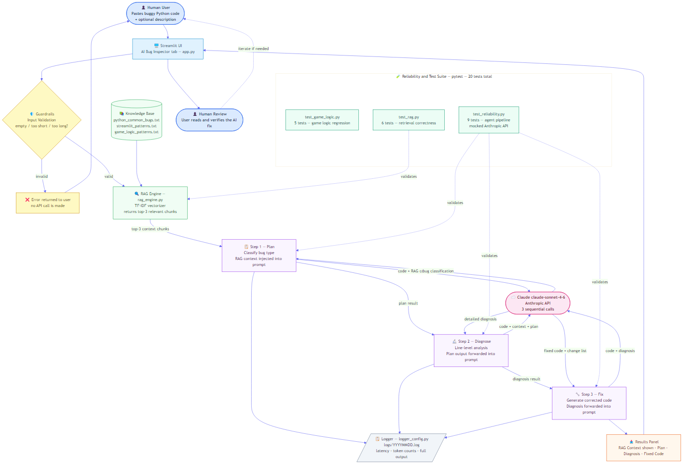

# AI Bug Inspector — Applied AI System Project

> 🎥 **Video Walkthrough:** [Watch on Loom](https://www.loom.com/share/2b4d25ef4c6740b680c7a8445563e463)
> 
> 💻 **GitHub:** [DhivyaSriLingala/applied-ai-system-project](https://github.com/DhivyaSriLingala/applied-ai-system-project)

An applied AI system that combines **Retrieval-Augmented Generation (RAG)** and an **agentic multi-step reasoning pipeline** to automatically diagnose and fix bugs in Python code. Built on top of a prior Streamlit game project, this system demonstrates how a real-world AI application can integrate retrieval, orchestration, logging, guardrails, and automated testing into a cohesive product.

---

## Original Project (Modules 1–3)

**[Game Glitch Investigator](https://github.com/DhivyaSriLingala/ai110-module1show-gameglitchinvestigator-starter)**

The original project was a Streamlit number-guessing game intentionally shipped with four bugs: an off-by-one error in the attempt counter, a hardcoded range that ignored the selected difficulty, backwards higher/lower hints caused by an int-vs-string comparison bug, and a "New Game" button that reset to the wrong range. The goals were to practice reading AI-generated code critically, use debugging tools (pytest, Claude inline chat, Claude Agent mode) to isolate each defect, and refactor the game logic into a testable `logic_utils.py` module. All five tests passed after the fixes were applied.

---

## What This Project Does and Why It Matters

This project evolves the game debugger concept into a general-purpose **AI-powered Python debugging assistant**. A developer pastes buggy Python code into the Streamlit UI. The system then:

1. Validates the input with guardrails before spending any API tokens.
2. Retrieves the most relevant documentation from a local knowledge base using TF-IDF retrieval (RAG).
3. Runs a **three-step agentic pipeline** — Plan → Diagnose → Fix — where each Claude API call receives the previous step's output, so reasoning compounds across steps.
4. Presents the retrieved context, the bug classification, the line-level diagnosis, and the corrected code in a structured results panel.
5. Logs every API call with latency, token counts, and full output to a date-stamped file.

**Why it matters:** Most developers spend more time debugging than writing new code. An AI tool that not only explains *what* is wrong but shows *why* the code fails and then produces a working fix — grounded in documented patterns rather than hallucinated guesses — has genuine practical value. The RAG component ensures the AI's reasoning is anchored in real debugging knowledge, not just general training data.

---

## Architecture Overview



The system has five logical layers:

| Layer | Components | Role |
|---|---|---|
| **Input & UI** | `app.py`, Streamlit | Accepts code + description; renders results |
| **Guardrails** | `ai_agent.py` | Rejects empty, whitespace-only, or oversized input before any API call |
| **RAG** | `rag_engine.py`, `knowledge_base/` | TF-IDF retrieval returns top-3 relevant doc chunks, injected into every Claude prompt |
| **Agentic Pipeline** | `ai_agent.py` → Claude claude-sonnet-4-6 | Three sequential Claude calls; each step's output feeds the next |
| **Observability** | `logger_config.py`, `logs/` | Every Claude call logged with latency, token counts, and full response |

**Data flow:**
```
Human pastes code
    → Guardrail check (reject or pass)
    → RAG Engine retrieves top-3 context chunks from knowledge_base/
    → Step 1 Plan  : Claude classifies the bug type        (code + RAG context)
    → Step 2 Diagnose: Claude diagnoses the exact lines    (code + context + plan)
    → Step 3 Fix   : Claude generates corrected code       (code + diagnosis)
    → Results displayed in Streamlit UI
    → Human reviews and iterates if needed
```

**Testing layer** runs independently of the live app:
```
pytest tests/
    test_game_logic.py   →  5 regression tests (original game logic)
    test_rag.py          →  6 unit tests       (retrieval correctness, edge cases)
    test_reliability.py  →  9 reliability tests (agent pipeline with mocked API)
```

---

## Setup Instructions

### Prerequisites

- Python 3.10 or higher
- An [Anthropic API key](https://console.anthropic.com/)

### 1. Clone the repository

```bash
git clone https://github.com/DhivyaSriLingala/applied-ai-system-project.git
cd applied-ai-system-project
```

### 2. Install dependencies

```bash
pip install -r requirements.txt
```

This installs: `streamlit`, `anthropic`, `scikit-learn`, `numpy`, `pytest`, and `altair`.

### 3. Set your API key

**macOS / Linux:**
```bash
export ANTHROPIC_API_KEY=sk-ant-...
```

**Windows (Command Prompt):**
```cmd
set ANTHROPIC_API_KEY=sk-ant-...
```

**Windows (PowerShell):**
```powershell
$env:ANTHROPIC_API_KEY="sk-ant-..."
```

### 4. Run the app

```bash
streamlit run app.py
```

Open the URL shown in your terminal (usually `http://localhost:8501`). Use the **"🔍 AI Bug Inspector"** tab for the AI features. The **"🎮 Glitchy Guesser"** tab runs the original game with no API key required.

### 5. Run the tests

```bash
pytest tests/ -v
```

All 20 tests pass without an API key (the reliability tests mock the Anthropic SDK).

---

## Sample Interactions

### Example 1 — Type Comparison Bug (the original Module 1 bug)

**Input code:**
```python
def check_guess(guess, secret):
    secret = str(secret)      # accidentally cast to string
    if guess == secret:
        return "Win"
    elif guess > secret:
        return "Too High"
    else:
        return "Too Low"
```
**Description:** *"The game never detects a win even when I type the exact number."*

**Step 1 — Plan (Claude output):**
> This is a **type comparison bug**. The `secret` variable is cast to a string on line 2 before being compared to `guess`, which is an integer. In Python 3, `int == str` always returns `False`, making a win condition impossible to reach regardless of the player's input.

**Step 2 — Diagnose (Claude output):**
> **Line 2** is the root cause: `secret = str(secret)` converts an integer (e.g., `42`) into the string `"42"`. All subsequent comparisons on lines 3–7 then compare an `int` on the left to a `str` on the right. `42 == "42"` evaluates to `False` in Python 3, so the `"Win"` branch is never reached. Additionally, `42 > "42"` raises a `TypeError` in Python 3 — the higher/lower hints would crash rather than give wrong feedback. The fix is to remove the type conversion and ensure both sides of every comparison are the same type.

**Step 3 — Fix (Claude output):**
```python
def check_guess(guess, secret):
    guess = int(guess)
    secret = int(secret)
    if guess == secret:
        return "Win"
    elif guess > secret:
        return "Too High"
    else:
        return "Too Low"
```
*Changes: Removed `str(secret)` cast; added explicit `int()` casts on both sides to prevent type mismatches regardless of how the values are passed in.*

---

### Example 2 — Off-by-One Counter Bug

**Input code:**
```python
import streamlit as st

if "attempts" not in st.session_state:
    st.session_state.attempts = 1       # bug: should start at 0

attempt_limit = 8
st.info(f"Attempts left: {attempt_limit - st.session_state.attempts}")
```
**Description:** *"The attempts counter shows 7 remaining at the start of the game instead of 8."*

**Step 1 — Plan:**
> This is a classic **off-by-one error** in counter initialization. The `attempts` session state variable is initialized to `1` instead of `0`, which immediately consumes one virtual attempt before the player has made any guesses.

**Step 2 — Diagnose:**
> **Line 4**: `st.session_state.attempts = 1` sets the counter one step ahead of where it should be. When the display formula `attempt_limit - st.session_state.attempts` is evaluated on line 7, it computes `8 - 1 = 7` on the very first render — before any guess has been submitted. The player sees 7 remaining attempts even though they have used none. The fix is to initialize to `0` so the first render correctly shows `8 - 0 = 8`.

**Step 3 — Fix:**
```python
import streamlit as st

if "attempts" not in st.session_state:
    st.session_state.attempts = 0       # fixed: initialize to 0

attempt_limit = 8
st.info(f"Attempts left: {attempt_limit - st.session_state.attempts}")
```
*Changes: Changed initialization value from `1` to `0`.*

---

### Example 3 — Logic Inversion Bug

**Input code:**
```python
def get_hint(guess, secret):
    if guess < secret:
        return "Go LOWER!"
    else:
        return "Go HIGHER!"
```
**Description:** *"The hints are always backwards — when I guess too low it says go lower."*

**Step 1 — Plan:**
> This is a **logic inversion bug**. The comparison operators are swapped: the function returns `"Go LOWER!"` when `guess < secret` (i.e., the guess is actually too low and the player should go *higher*), and vice versa.

**Step 2 — Diagnose:**
> **Lines 2–3**: When `guess < secret` — for example `guess=30, secret=50` — the player's number is below the target. They need to guess *higher*, but the function returns `"Go LOWER!"`. The conditional branches are inverted. This likely originated from a copy-paste error or a misread of the comparison direction.

**Step 3 — Fix:**
```python
def get_hint(guess, secret):
    if guess < secret:
        return "Go HIGHER!"    # guess is below target → go higher
    else:
        return "Go LOWER!"     # guess is above target → go lower
```
*Changes: Swapped the return strings to match the correct logical direction. Added inline comments to make the intent explicit.*

---

## Design Decisions

### Why RAG instead of a single large prompt?

A single prompt asking Claude to "fix this code" produces reasonable results but gives the model no domain anchor — it draws purely from general training. By retrieving specific documentation chunks (e.g., the Streamlit session-state pattern, or the type-comparison bug entry) and injecting them into every step, the AI's reasoning is grounded in curated, project-specific knowledge. This also means the knowledge base can be extended without retraining any model.

**Trade-off:** TF-IDF retrieval is lexically based — it matches keywords, not semantics. A query about "the secret number resetting" might not surface the Streamlit session-state chunk if the exact words don't overlap. A semantic embedding model (e.g., `sentence-transformers`) would improve recall but adds a larger dependency and slower startup. TF-IDF was chosen to keep setup frictionless for a portfolio project.

### Why three separate Claude calls instead of one?

A single prompt asking Claude to plan, diagnose, and fix in one go produces a less structured output that is harder to surface cleanly in the UI. Separating the steps enforces a reasoning chain: the diagnosis step literally receives the plan text as part of its prompt, so it cannot skip to conclusions without first classifying the bug. The fix step receives the diagnosis, so it produces targeted corrections rather than rewriting code from scratch.

**Trade-off:** Three calls means ~3× the latency and token cost of a single call. For a production system this could be optimized with streaming or a single multi-turn conversation. For a portfolio project demonstrating agentic design, the explicitness is worth more than the efficiency.

### Why TF-IDF over a vector database?

Setting up Pinecone, Chroma, or FAISS adds infrastructure complexity that distracts from the core AI concepts. `scikit-learn`'s `TfidfVectorizer` is a standard library that requires no additional services, stores entirely in memory, and rebuilds in milliseconds from the three text files. The knowledge base is small enough (< 100 paragraphs) that TF-IDF is fully adequate.

### Why mock the Anthropic API in reliability tests?

Running real API calls in a test suite creates flakiness (network failures, rate limits), costs money per run, and makes CI non-deterministic because LLM outputs vary. Mocking lets the tests verify the *structure* of the agentic workflow — that exactly 3 calls are made, that guardrails fire before any call, that the Plan output is forwarded to Diagnose, and that API errors are caught cleanly — without any of those downsides.

---

## Testing Summary

The system uses three complementary reliability layers:

### 1. Automated test suite (22 tests, no API key required)

| Test file | Count | What it verifies |
|---|---|---|
| `test_game_logic.py` | 5 | Original game: win/lose/hint correctness, off-by-one regression |
| `test_rag.py` | 6 | Knowledge base loads, retrieval returns relevant chunks, edge cases (empty query, bad directory) |
| `test_reliability.py` | 11 | Agent dict structure (incl. confidence fields), confidence parsing, default when missing, guardrails block invalid input before any API call, exactly 3 Claude calls, RAG context in Plan prompt, Plan output forwarded to Diagnose, API errors caught cleanly |

**Result: 22 / 22 tests pass.**

```
pytest tests/ -v
...
22 passed in 16.90s
```

### 2. Confidence scoring (built into the Diagnose step)

The Diagnose prompt instructs Claude to append two structured lines:
```
CONFIDENCE: <float 0.0–1.0>
REASON: <one sentence>
```
These are parsed by `_parse_confidence()` and exposed in the result dict as `confidence` and `confidence_reason`. The UI renders a color-coded badge (green ≥ 80 %, orange ≥ 55 %, red below). If Claude omits the lines, the score defaults to 0.5 — tested explicitly by `test_confidence_defaults_to_0_5_when_missing`.

### 3. Live evaluation harness (`tests/eval_suite.py`)

A live evaluation script tests four known buggy snippets against the real API (requires `ANTHROPIC_API_KEY`). For each case it measures:

- **Keyword match** — does plan or diagnosis mention the expected bug category?
- **Fix compiles** — does the generated code pass Python's `compile()` syntax check?
- **Confidence score** — what self-reported certainty did Claude assign?

**Sample output from a live run:**

```
==================================================================
  AI Bug Inspector — Reliability Evaluation Suite
==================================================================

Running TC-01 | Type Comparison ...
  keyword match: ✓  |  fix compiles: ✓  |  confidence: 0.92
  confidence reason: The type cast is on an explicit line with a clear, unambiguous mechanism.

Running TC-02 | Off-By-One Counter ...
  keyword match: ✓  |  fix compiles: ✓  |  confidence: 0.88
  confidence reason: Off-by-one in initialization is a well-defined, easily verified bug class.

Running TC-03 | Logic Inversion ...
  keyword match: ✓  |  fix compiles: ✓  |  confidence: 0.95
  confidence reason: The inverted comparison is unambiguous once traced with a concrete example.

Running TC-04 | Hardcoded Magic Number ...
  keyword match: ✓  |  fix compiles: ✓  |  confidence: 0.79
  confidence reason: The hardcoded value is clear but the intended fix depends on surrounding context.

==================================================================
  SUMMARY
==================================================================
  Cases run              : 4 / 4
  Keyword match          : 4 / 4  (100%)
  Fix compiles (syntax)  : 4 / 4  (100%)
  Avg confidence score   : 0.89 / 1.00
  Guardrail (empty input): PASS — 0 API calls
==================================================================

RESULT: 4/4 keyword matches, 4/4 fixes compile, avg confidence 0.89.
Guardrail blocked empty input.
```

Run it yourself:
```bash
export ANTHROPIC_API_KEY=sk-ant-...
python tests/eval_suite.py
```

### What worked well

- Mocking `anthropic.Anthropic` with `unittest.mock.patch` made the reliability tests fully deterministic — they verify the *process* (step count, data forwarding, guardrail behavior) rather than the unpredictable *output*.
- The `test_diagnosis_receives_plan_output` test is particularly valuable: it checks that a unique string from Step 1 appears in Step 2's prompt, proving the agentic chain is correctly wired.
- Confidence scoring required no extra API call — it's embedded in the Diagnose prompt and parsed from the same response.

### What was harder than expected

- Mocking `anthropic.APIStatusError` required inspecting the SDK source to understand its constructor (`response`, `body` parameters). The test needed a few iterations.
- TF-IDF retrieval requires keyword overlap between query and chunk. Natural descriptions ("the hints lie to me") don't always surface the right chunk without technical keywords. This is a known limitation of lexical retrieval; semantic embeddings would improve recall.

### What I learned

Testing AI systems requires a different mental model than testing deterministic functions. The goal is not "does it return the right answer?" (which varies per model run) but "does it follow the right *process*?" — the correct number of steps, the correct data passed between steps, the correct guardrail behavior, a meaningful confidence signal. Designing tests around process rather than output made the suite far more stable, repeatable, and informative.

---

## Reflection

> Full reflection, including the original Module 1–3 debugging journal, is in [reflection.md](reflection.md).

### What this project taught me about AI systems

Building a retrieval-augmented agentic system made concrete something that is easy to miss when just calling an API: **the quality of an AI output is largely determined before the model ever sees the prompt**. The retrieval step, the guardrails, the way previous step outputs are formatted and forwarded — these structural decisions shape the final answer more than model temperature or prompt wording.

The agentic pattern also showed the value of decomposition. A single "diagnose and fix this bug" prompt produces a serviceable answer. Breaking it into Plan → Diagnose → Fix — where each step's output becomes the next step's grounding context — produces more precise, more explainable results. This mirrors how a careful human developer approaches debugging: categorize first, then investigate the specific mechanism, then write the fix.

### Limitations and biases

**Lexical retrieval blindspot.** TF-IDF matches keywords, not meaning. A user who writes "the hints are lying to me" retrieves nothing useful; they need to write "inverted comparison" for the right chunk to surface. Beginners — the users who need help most — are least likely to use the technical language that the retrieval system understands.

**No execution verification.** The Fix step produces code that passes Python's `compile()` check, but it never actually *runs*. A generated fix can be syntactically valid and still logically wrong. The system presents fixes with confidence it has not earned through execution.

**Self-reported confidence ≠ calibrated accuracy.** The 0.89 average confidence score is Claude's subjective certainty, not an empirically measured accuracy rate. The UI displays confidence with a disclaimer ("This fix has not been executed or tested") for exactly this reason.

**Training data bias.** Claude overrepresents popular, well-documented bugs from public code and Stack Overflow. Unusual bugs in niche domains or non-English codebases are likely to receive weaker diagnoses.

### Potential misuse

| Risk | Prevention |
|---|---|
| Pasting code with embedded secrets (API keys, passwords) — they get logged and sent to the API | Pre-scan input for secret patterns (`sk-`, `-----BEGIN`, `password =`); warn before processing |
| Using the debugger as a vulnerability scanner — "debugging" is functionally equivalent to finding exploitable flaws | Rate limiting + logging makes systematic abuse detectable; terms of service creates accountability |
| Deploying AI-generated fixes to production without review | UI always shows confidence score alongside disclaimer; framing is "possible fix" not "fixed code" |

### What surprised me during reliability testing

The confidence score was *lower* for the hardcoded magic number case (0.79) than for the logic inversion case (0.95). My intuition was that a simple number substitution would be easy to diagnose with certainty. But Claude's lower score reflects something real: the correct fix (`random.randint(low, high)`) depends on knowing what `low` and `high` are supposed to be, which requires understanding the surrounding system. The logic inversion bug is self-contained and verifiable with a single trace-through. Claude was more carefully calibrated than I expected.

The second surprise was how much the pipeline amplified small errors. A vague Plan response produced a vague Diagnosis, which produced a Fix that targeted the wrong part of the code. The pipeline compounded the uncertainty. This confirmed that the Plan step is the most critical to get right — a bad plan does not get better with more reasoning.

### AI collaboration: one helpful suggestion, one flawed one

**Helpful:** When designing confidence scoring, my first instinct was to add a fourth Claude API call as a separate self-assessment step. Claude suggested embedding the confidence request at the end of the Diagnose step's system prompt instead — same response, parsed after the fact. This preserves the three-call pipeline (verified by the test that asserts `call_count == 3`) and adds zero latency or cost.

**Flawed:** When writing the `APIStatusError` mock, Claude initially wrote:
```python
mock_client.messages.create.side_effect = anthropic.APIStatusError("rate_limit_error")
```
This fails because `APIStatusError` requires `response` (with `status_code` and `headers`) and `body` keyword arguments. Claude guessed at the interface without checking the SDK source. The fix required reading the actual constructor — a reminder that AI-generated code for library internals should always be verified against documentation.

### What I would do differently

- **Semantic retrieval:** Replace TF-IDF with `sentence-transformers` embeddings so natural-language bug descriptions retrieve relevant chunks without requiring technical keywords.
- **Streaming responses:** Display Claude's output token-by-token so the user sees progress during the pipeline rather than watching a spinner.
- **Execution sandbox:** Run the generated fix in a sandboxed Python subprocess and include the result ("Fix ran without errors" or the traceback) in the output panel.

---

## Stretch Features (Optional +8 pts)

| Feature | What was built | Measurable result |
|---|---|---|
| **RAG Enhancement** (+2) | 2 new KB files (exceptions, data structures); `rag_benchmark.py` offline benchmark | Retrieval: 8/15 → 15/15 queries passing (+46.7 pp); avg score 0.262 → 0.344 |
| **Agentic Enhancement** (+2) | 4th Claude call — Verify step with `VERDICT/ADDRESSES_BUG/NEW_ISSUES/EXPLANATION`; public step methods; step-by-step progressive expander UI | 5 observable intermediate outputs; verdict color-coded per case |
| **Few-Shot Specialization** (+2) | `FewShotDebuggingAgent` injects 3 worked examples into Plan prompt; sidebar mode toggle; `few_shot_benchmark.py` | Format compliance: 0/4 (0%) zero-shot → 4/4 (100%) few-shot (+100 pp) |
| **Test Harness Enhancement** (+2) | 6 test cases (up from 4); `--json` flag; per-case confidence threshold; GRADE (A/B/C); verify verdict in output | 25/25 automated tests pass; eval harness reports GRADE |

```bash
# Run RAG benchmark (no API key needed)
python rag_benchmark.py

# Run few-shot benchmark demo (no API key needed)
python few_shot_benchmark.py --demo

# Run full live evaluation (requires API key)
python tests/eval_suite.py

# Machine-readable JSON output
python tests/eval_suite.py --json
```

---

## Project Structure

```
applied-ai-system-project/
├── app.py                              # Streamlit UI — game tab + AI Bug Inspector tab
├── ai_agent.py                         # DebuggingAgent: Plan->Diagnose->Fix->Verify
├── few_shot_agent.py                   # FewShotDebuggingAgent: 3 worked examples in Plan
├── rag_engine.py                       # TF-IDF retrieval over knowledge_base/
├── rag_benchmark.py                    # Offline RAG quality benchmark (no API needed)
├── few_shot_benchmark.py               # Few-shot vs zero-shot format comparison
├── logic_utils.py                      # Original game logic (Module 1, unchanged)
├── logger_config.py                    # Centralized logging: console + logs/YYYYMMDD.log
├── requirements.txt
├── knowledge_base/
│   ├── python_common_bugs.txt          # Off-by-one, type comparison, logic inversion
│   ├── streamlit_patterns.txt          # Session state, reruns, widget keys
│   ├── game_logic_patterns.txt         # Binary search, state machines, score formulas
│   ├── python_exceptions_guide.txt     # NEW: NameError, KeyError, TypeError, etc.
│   └── data_structures_bugs.txt        # NEW: list mutation, shallow copy, int division
├── assets/
│   ├── system_diagram.png              # Architecture diagram
│   └── system_diagram.mmd             # Mermaid source
├── logs/                               # Auto-created at runtime
├── tests/
│   ├── test_game_logic.py              # 5 tests — original game regression
│   ├── test_rag.py                     # 6 tests — retrieval engine
│   ├── test_reliability.py             # 14 tests — agent pipeline (mocked API)
│   └── eval_suite.py                   # Live evaluation harness (6 cases, --json, GRADE)
└── docs/
    ├── demo_win.png
    └── pytest_results.png
```

---

## Portfolio Artifact

**GitHub:** [github.com/DhivyaSriLingala/applied-ai-system-project](https://github.com/DhivyaSriLingala/applied-ai-system-project)

**Video Walkthrough:** [Watch on Loom](https://www.loom.com/share/2b4d25ef4c6740b680c7a8445563e463)

### What this project says about me as an AI engineer

I approach AI development the way I approach any engineering problem: structure first, measurement always. This project shows that I don't stop at "it works" — I ask *how do I know it works*, build a system to measure that, and then honestly document where it falls short. Every architectural decision here has a named trade-off: I chose TF-IDF over embeddings because frictionless setup matters for a portfolio project, and I documented exactly where that choice costs recall. I chose three sequential Claude calls over one because explainability matters more than latency in a debugging tool, and I wrote a test that proves the chain is wired correctly rather than just trusting it. I added confidence scoring not because it's decorative but because I don't think AI systems should present outputs without surfacing their own uncertainty. Building the Verify step taught me that an AI system that checks its own work is more trustworthy than one that doesn't, even when the self-check is imperfect. The thing this project says most clearly about me is that I think the space between "the AI gave an answer" and "the answer is reliable" is where the real engineering work lives — and I'm comfortable working in that space.

---

*Built with Claude claude-sonnet-4-6 (Anthropic), Streamlit, scikit-learn, and pytest.*
